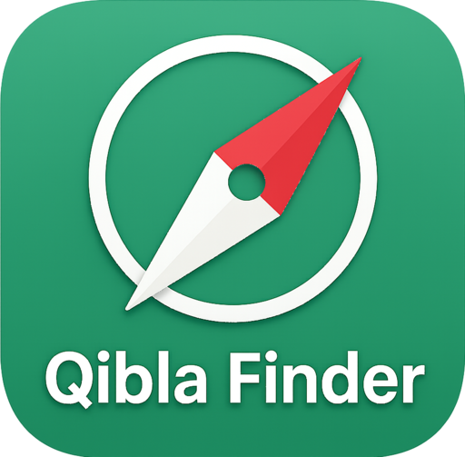

# 🕋 Qibla Finder

<div align="center">
  
  <br>
  <em>Find your direction to the Kaaba with precision and ease</em>
</div>

Ever found yourself in a new city, unsure which way to face for prayer? I built this app to solve that exact problem. Qibla Finder uses your phone's sensors and GPS to point you in the right direction - no more guessing or asking around!

## 🌟 What Makes This App Special

I've packed this app with features that actually work in real-world situations:

- **🎯 Pinpoint Accuracy**: Uses your phone's compass and GPS to calculate the exact direction to the Kaaba
- **🗺️ Smart Location**: Can't get GPS signal? No problem - manually set your location on the map
- **📱 AR Mode**: Point your camera and see a real-time arrow showing you exactly where to face
- **🧭 Compass Calibration**: Interactive calibration to make sure your compass is spot-on
- **📐 Phone Detection**: Knows when your phone is flat or tilted - gives you the right guidance
- **⚡ Fast & Reliable**: Works offline, loads maps quickly, and doesn't drain your battery
- **🎨 Beautiful Design**: Clean, modern interface that's easy to use

## 📱 Screenshots

[Add screenshots here]

## 🛠️ Built With Modern Tech

I chose these technologies because they're reliable and fast:

- **Kotlin** - Because it's the future of Android development
- **Jetpack Compose** - For smooth, beautiful UI animations
- **Google Location Services** - For accurate GPS positioning
- **Android Sensors** - To read your phone's compass and movement
- **OpenStreetMap** - Free, detailed maps that work offline
- **ARCore** - For the augmented reality camera feature
- **GitHub Actions** - So the app builds automatically when I update it

## 🚀 Want to Try It Out?

### What You'll Need
- Android Studio (the latest version works best)
- A phone running Android 7.0 or newer
- Google Play Services (most phones have this)

### Quick Setup

1. **Get the code**
```bash
git clone https://github.com/bizzkoot/Qibla_Finder.git
```

2. **Open it up**
```bash
cd Qibla_Finder
```

3. **Build it**
```bash
./gradlew build
```

4. **Install on your phone**
```bash
./gradlew installDebug
```

That's it! The app should now be on your phone and ready to use.

## 📋 What Your Phone Needs

- **Android Version**: 7.0 or newer (covers most phones from the last 5 years)
- **Latest Version**: Works great on Android 14
- **Permissions**: Location access (for GPS) and camera (for AR mode)
- **Hardware**: GPS, compass, and motion sensors (most modern phones have these)

## 🔧 Building the App

### For Testing (Debug Version)
```bash
./gradlew assembleDebug
```

### For Release (Signed Version)
```bash
./gradlew assembleRelease
```

### Running Tests
```bash
./gradlew test
```

## 📄 License

This project is licensed under the MIT License - see the [LICENSE](LICENSE) file for details.

## 🤝 Want to Help?

I'd love your help making this app even better! Here's how:

1. **Fork** this repository
2. **Create** a new branch for your feature (`git checkout -b feature/YourAmazingIdea`)
3. **Make** your changes and commit them (`git commit -m 'Add your amazing feature'`)
4. **Push** to your branch (`git push origin feature/YourAmazingIdea`)
5. **Open** a Pull Request and let's discuss your changes!

Feel free to open an issue if you find a bug or have a suggestion.

## 📞 Need Help?

Found a bug? Have a question? Want to suggest a feature? Just open an issue on GitHub - I'll get back to you as soon as I can!

## 🗺️ What's Coming Next

I'm always working on making this app better. Here's what I'm planning:

- [ ] **Better AR Experience** - More accurate and smoother camera guidance
- [ ] **Offline Maps** - Download maps so you can use the app anywhere
- [ ] **Multiple Languages** - Support for Arabic, Indonesian, and more
- [ ] **Home Screen Widget** - Quick Qibla direction without opening the app
- [ ] **Wear OS Support** - Use your smartwatch to find the Qibla direction

## 📊 Development Status

I keep track of everything I'm working on in [Progress.md](Progress.md). Check it out to see what's done and what's still in progress!

## 🔄 CI/CD Status

[](https://github.com/bizzkoot/Qibla_Finder/actions)

## 📦 Get the App

The latest version is always available in the [Releases](https://github.com/bizzkoot/Qibla_Finder/releases) section. Just download the APK and install it on your phone!

## 🎯 How It Works

### Finding the Right Direction
The app uses your phone's GPS to know exactly where you are, then calculates the direction to the Kaaba in Mecca. It's like having a digital compass that always points to the right place!

### When GPS Doesn't Work
Sometimes GPS signals are weak (like indoors). No worries - you can manually set your location on the map. Just drag the pin to where you are, and the app will calculate the direction from there.

### AR Camera Mode
Point your camera at the sky, and you'll see an arrow showing you exactly which way to face. It's like having a virtual guide pointing you in the right direction!

### Smart Phone Detection
The app knows when your phone is lying flat or being held up. It gives you different guidance based on how you're holding it, so you always get the right instructions.

## 🚨 Having Trouble?

The app includes a built-in troubleshooting guide that covers most common issues. If you're still having problems, check the [Issues](https://github.com/bizzkoot/Qibla_Finder/issues) section or open a new one - I'm here to help!

## 📈 How Well Does It Work?

- **GPS Accuracy**: Within 5 meters when outdoors, 30 meters when using network location
- **Compass Precision**: Within 2 degrees after calibration (that's really accurate!)
- **AR Smoothness**: 60 frames per second on supported phones
- **Map Speed**: Loads in under 2 seconds, even on slower connections

---

**Built with ❤️ for the Muslim community** # Test change
