# 🕋 Qibla Finder

<div align="center">
  
  <br>
  <h2><em>Find your direction to the Kaaba with precision and ease</em></h2>
  
  [](https://github.com/bizzkoot/Qibla_Finder/actions)
  [](https://opensource.org/licenses/MIT)
  [](https://developer.android.com/about/versions/nougat)
  [](https://kotlinlang.org/)
  
  <br>
  
  **[📥 Download Latest Release](https://github.com/bizzkoot/Qibla_Finder/releases/latest)** | **[🐛 Report Bug](https://github.com/bizzkoot/Qibla_Finder/issues)** | **[💡 Request Feature](https://github.com/bizzkoot/Qibla_Finder/issues)**
  
  <br>
  
  *Ever found yourself in a new city, unsure which way to face for prayer? Qibla Finder uses your phone's sensors and GPS to point you in the right direction - no more guessing or asking around!*
</div>

---

## 🌟 What Makes This App Special

<div align="center">
  <table>
    <tr>
      <td align="center" width="33%">
        <strong>🎯 Pinpoint Accuracy</strong><br>
        <em>Uses your phone's compass and GPS to calculate the exact direction to the Kaaba</em>
      </td>
      <td align="center" width="33%">
        <strong>🗺️ Smart Location</strong><br>
        <em>Can't get GPS signal? No problem - manually set your location on the map</em>
      </td>
      <td align="center" width="33%">
        <strong>📱 AR Mode</strong><br>
        <em>Point your camera and see a real-time arrow showing you exactly where to face</em>
      </td>
    </tr>
    <tr>
      <td align="center">
        <strong>🧭 Compass Calibration</strong><br>
        <em>Interactive calibration to make sure your compass is spot-on</em>
      </td>
      <td align="center">
        <strong>📐 Phone Detection</strong><br>
        <em>Knows when your phone is flat or tilted - gives you the right guidance</em>
      </td>
      <td align="center">
        <strong>⚡ Fast & Reliable</strong><br>
        <em>Works offline, loads maps quickly, and doesn't drain your battery</em>
      </td>
    </tr>
  </table>
</div>

---

## ✨ Latest Features (v2.3.0) 🎉

<div align="center">
  <table>
    <tr>
      <td align="center" width="50%">
        <strong>🎯 Qibla Direction Line on Map</strong><br>
        <em>NEW! Real-time Qibla direction visualization on manual location map with accurate geodesic calculations</em>
      </td>
      <td align="center" width="50%">
        <strong>📍 Dynamic Zoom Button Positioning</strong><br>
        <em>Smart zoom buttons that automatically position themselves based on UI panel height across all screen densities</em>
      </td>
    </tr>
    <tr>
      <td align="center">
        <strong>🔄 Reliable Map Type Switching</strong><br>
        <em>Enhanced map switching between Street and Satellite views with improved state management and tile loading</em>
      </td>
      <td align="center">
        <strong>⚡ Performance Optimizations</strong><br>
        <em>Faster map interactions, optimized memory usage, and smooth 60fps rendering during all operations</em>
      </td>
    </tr>
  </table>
</div>

### Previous Features (v2.2.x)
- **🔄 Manual Update Check** - Check for app updates anytime with real-time status feedback
- **🔗 GitHub Integration** - Direct access to source code, bug reporting, and releases  
- **📊 Enhanced Download Experience** - Native download manager with progress tracking
- **📱 Professional Help Center** - Comprehensive help screen with app information

---

## 📱 App Screenshots

<div align="center">
  <table>
    <tr>
      <td align="center">
        
        <br><strong>Main Compass</strong><br>
        <em>Find your direction using GPS location</em>
      </td>
      <td align="center">
        
        <br><strong>AR Camera Mode</strong><br>
        <em>Point your camera for real-time guidance</em>
      </td>
      <td align="center">
        
        <br><strong>Manual Location</strong><br>
        <em>Set your location when GPS is unavailable</em>
      </td>
    </tr>
    <tr>
      <td align="center">
        
        <br><strong>Location Adjustment</strong><br>
        <em>Fine-tune your position on the map</em>
      </td>
      <td align="center">
        
        <br><strong>Compass Calibration</strong><br>
        <em>Ensure accurate compass readings</em>
      </td>
      <td align="center">
        
        <br><strong>Help & Support</strong><br>
        <em>Check for updates, access GitHub, and get help</em>
      </td>
    </tr>
  </table>
</div>

---

## 🚀 Quick Start

<div align="center">
  <h3>📥 Download & Install in 3 Steps</h3>
</div>

### **Option 1: Download Pre-built APK (Recommended)**
1. **📥 Download** the latest release from [Releases](https://github.com/bizzkoot/Qibla_Finder/releases)
2. **📱 Install** directly on your Android device
3. **🎯 Start** finding your Qibla direction!

### **Option 2: Build from Source**
```bash
# 1. Clone the repository
git clone https://github.com/bizzkoot/Qibla_Finder.git
cd Qibla_Finder

# 2. Build the app
./gradlew assembleDebug

# 3. Install on your device
./gradlew installDebug
```

---

## 🛠️ Built With Modern Tech

<div align="center">
  <table>
    <tr>
      <td align="center">
        <strong>🐘 Kotlin</strong><br>
        <em>Future of Android development</em>
      </td>
      <td align="center">
        <strong>🎨 Jetpack Compose</strong><br>
        <em>Smooth, beautiful UI animations</em>
      </td>
      <td align="center">
        <strong>📍 Google Location Services</strong><br>
        <em>Accurate GPS positioning</em>
      </td>
    </tr>
    <tr>
      <td align="center">
        <strong>📡 Android Sensors</strong><br>
        <em>Compass and movement detection</em>
      </td>
      <td align="center">
        <strong>🗺️ OpenStreetMap</strong><br>
        <em>Free, detailed offline maps</em>
      </td>
      <td align="center">
        <strong>📱 ARCore</strong><br>
        <em>Augmented reality camera feature</em>
      </td>
    </tr>
  </table>
</div>

---

## 📋 System Requirements

<div align="center">
  <table>
    <tr>
      <td align="center">
        <strong>📱 Android Version</strong><br>
        <em>7.0 or newer</em>
      </td>
      <td align="center">
        <strong>🔐 Permissions</strong><br>
        <em>Location & Camera</em>
      </td>
      <td align="center">
        <strong>⚙️ Hardware</strong><br>
        <em>GPS, Compass, Motion Sensors</em>
      </td>
    </tr>
  </table>
</div>

---

## 🎯 How It Works

### **App Flow & Logic**

```mermaid
flowchart TD
    A[📱 App Launch] --> B{🔐 Permissions Granted?}
    B -->|No| C[📋 Permission Screen]
    C --> D[✅ User Grants Permissions]
    D --> E[🧭 Main Compass Screen]
    B -->|Yes| E
    
    E --> F{📍 GPS Available?}
    F -->|Yes| G[🎯 Show Qibla Direction]
    F -->|No| H[🗺️ Manual Location Screen]
    H --> I[📍 User Sets Location]
    I --> J[🔄 Return to Compass]
    J --> G
    
    G --> K{🧭 Compass Status}
    K -->|✅ Accurate| L[🎯 Display Qibla]
    K -->|⚠️ Needs Calibration| M[🔄 Calibration Overlay]
    K -->|❌ Interference| N[⚠️ Interference Warning]
    
    L --> O{🎮 User Actions}
    O -->|📱 AR Mode| P[📷 AR Camera View]
    O -->|☀️ Sun Calibration| Q[🌅 Sun Calibration]
    O -->|🗺️ Manual Location| H
    O -->|❓ Help| R[📖 Troubleshooting Guide]
    
    P --> S[🔄 Return to Compass]
    Q --> S
    R --> S
    
    M --> T[🔄 Calibrate Compass]
    N --> U[🚫 Move Away from Metal]
    T --> G
    U --> G
    
    style A fill:#e1f5fe
    style E fill:#f3e5f5
    style G fill:#e8f5e8
    style P fill:#fff3e0
    style Q fill:#fff3e0
    style R fill:#fff3e0
```



### **Key Features Explained**

- **🎯 Pinpoint Accuracy**: Uses GPS and compass to calculate exact direction to Kaaba
- **🗺️ Smart Location**: Manual location setting when GPS is unavailable
- **📱 AR Camera Mode**: Real-time camera guidance with directional arrows
- **🧭 Compass Calibration**: Interactive calibration for accuracy
- **📐 Phone Detection**: Adapts guidance based on phone orientation
- **🔄 Smart Updates**: Manual update checking with native download experience
- **🔗 GitHub Integration**: Direct access to source code, issues, and releases

---

## 📊 Performance Metrics

<div align="center">
  <table>
    <tr>
      <td align="center">
        <strong>🎯 GPS Accuracy</strong><br>
        <em>Within 5m outdoors, 30m with network location</em>
      </td>
      <td align="center">
        <strong>🧭 Compass Precision</strong><br>
        <em>Within 2° after calibration</em>
      </td>
    </tr>
    <tr>
      <td align="center">
        <strong>📱 AR Smoothness</strong><br>
        <em>60 FPS on supported devices</em>
      </td>
      <td align="center">
        <strong>🗺️ Map Speed</strong><br>
        <em>Loads in under 2 seconds</em>
      </td>
    </tr>
  </table>
</div>

---

## 🧠 Design Decisions

### ✅ Qibla Direction Line on Manual Map - Now Available!

**UPDATE**: We've successfully implemented the Qibla direction line on the manual location map! 🎉

After careful technical analysis and implementation, the manual map now features:

1.  **🎯 Accurate Geodesic Calculations**: Uses great circle calculations to show the true shortest path on Earth's curved surface
2.  **⚡ Real-time Updates**: Direction line updates instantly as you drag the location pin
3.  **🔄 Smart Redraw System**: Automatic redraw when needed, with manual redraw button for user control
4.  **📱 Performance Optimized**: Efficient rendering that maintains smooth 60fps interaction

**Previous Challenge Solved**: We initially avoided showing direction lines due to accuracy concerns with straight lines on 2D maps. Our new implementation uses proper geodesic mathematics to display the true great circle path to the Kaaba.

The manual map now serves as both **input** (setting your location) and **visual confirmation** (seeing the direction), while maintaining the compass and AR views as the most precise tools for final real-world orientation.

**[➡️ Read the full technical implementation details here](docs/technical/MAP_DIRECTION_LINE_ANALYSIS.md)**

---

## 📚 Documentation

### **For Developers**
- [**🚀 Git Push Guide**](docs/guides/GIT_PUSH_GUIDE.md) - Complete guide for pushing changes and triggering releases
- [**📝 Commit Conventions**](docs/development/COMMIT_CONVENTIONS.md) - How to write commit messages for automated versioning
- [**🎯 Release Guide**](docs/guides/RELEASE_GUIDE.md) - Understanding the automated release system
- [**🔧 GitHub Steps**](docs/guides/GitHub_Steps.md) - GitHub setup and configuration
- [**📊 Progress Tracking**](docs/development/Progress.md) - Development progress and roadmap

### **For Users**
- [**🔍 Troubleshooting Guide**](docs/technical/Troubleshooting.md) - Common issues and solutions
- [**⚙️ Technical Details**](docs/technical/Technical.md) - Technical implementation details
- [**🎨 UX Design**](docs/technical/UX.md) - User experience design principles

---

## 🗺️ Roadmap

<div align="center">
  <h3>🚧 What's Coming Next</h3>
</div>

- [ ] **🎯 Better AR Experience** - More accurate and smoother camera guidance
- [ ] **🗺️ Offline Maps** - Download maps so you can use the app anywhere
- [ ] **🌍 Multiple Languages** - Support for Arabic, Indonesian, and more
- [ ] **📱 Home Screen Widget** - Quick Qibla direction without opening the app
- [ ] **⌚ Wear OS Support** - Use your smartwatch to find the Qibla direction

---

## 🤝 Contributing

<div align="center">
  <h3>💡 Want to Help?</h3>
  <p>I'd love your help making this app even better!</p>
</div>

1. **🍴 Fork** this repository
2. **🌿 Create** a new branch (`git checkout -b feature/YourAmazingIdea`)
3. **✏️ Make** your changes and commit them (`git commit -m 'Add your amazing feature'`)
4. **📤 Push** to your branch (`git push origin feature/YourAmazingIdea`)
5. **🔀 Open** a Pull Request and let's discuss your changes!

---

## 🚨 Support & Help

<div align="center">
  <h3>❓ Need Help?</h3>
</div>

- **🐛 Found a bug?** [Open an issue](https://github.com/bizzkoot/Qibla_Finder/issues)
- **💡 Have a suggestion?** [Request a feature](https://github.com/bizzkoot/Qibla_Finder/issues)
- **❓ Need help?** Check the [Troubleshooting Guide](docs/technical/Troubleshooting.md)
- **📧 Questions?** Open a GitHub issue

---

## 📄 License

This project is licensed under the MIT License - see the [LICENSE](LICENSE) file for details.

---

<div align="center">
  <h3>🕋 Built with ❤️ for the Muslim community</h3>
  <p><em>May this app help you find your direction to the Kaaba with ease and accuracy.</em></p>
</div>