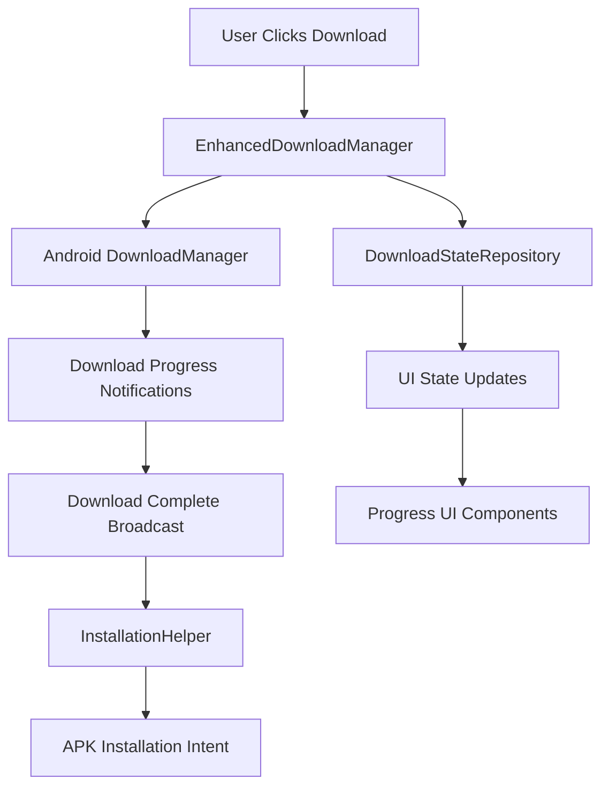

# Enhanced DownloadManager Implementation Guide

## 🎯 Overview

This guide provides a complete implementation of an Enhanced DownloadManager system for downloading APK updates from GitHub releases. This approach replaces the current browser-based download with a native Android download experience while maintaining the existing GitHub API integration.

## 📋 Table of Contents

1. [Current vs Enhanced Implementation](#current-vs-enhanced-implementation)
2. [Prerequisites](#prerequisites)
3. [Architecture Overview](#architecture-overview)
4. [Implementation Steps](#implementation-steps)
5. [Code Implementation](#code-implementation)
6. [UI Integration](#ui-integration)
7. [Testing Guide](#testing-guide)
8. [Troubleshooting](#troubleshooting)
9. [Best Practices](#best-practices)

## 🔄 Current vs Enhanced Implementation

### Current Implementation
```kotlin
// Simple browser intent (MainActivity.kt)
onDownload = {
    updateNotificationViewModel.downloadUpdate()
    updateUiState.downloadUrl?.let { url ->
        val intent = Intent(Intent.ACTION_VIEW, Uri.parse(url))
        startActivity(intent)
        updateNotificationViewModel.onDownloadInitiated()
    }
}
```

**Issues:**
- User leaves the app
- No progress tracking
- No download control
- Poor user experience

### Enhanced Implementation
- ✅ Native Android download experience
- ✅ Progress tracking with notifications
- ✅ Download resume capability
- ✅ Automatic installation prompting
- ✅ User stays within the app
- ✅ Better error handling

## 📚 Prerequisites

### Required Permissions

Add to `app/src/main/AndroidManifest.xml`:

```xml
<!-- For downloading files to external storage -->
<uses-permission android:name="android.permission.WRITE_EXTERNAL_STORAGE"
    android:maxSdkVersion="28" />

<!-- For installing APK files -->
<uses-permission android:name="android.permission.REQUEST_INSTALL_PACKAGES" />

<!-- For monitoring download completion -->
<uses-permission android:name="android.permission.WAKE_LOCK" />
```

### Required Dependencies

Add to `app/build.gradle`:

```gradle
dependencies {
    // For file provider (APK installation)
    implementation 'androidx.core:core-ktx:1.12.0'
    
    // For background processing
    implementation 'androidx.work:work-runtime-ktx:2.9.0'
    
    // Existing dependencies...
}
```

## 🏗️ Architecture Overview



## 🛠️ Implementation Steps

### Step 1: Create Enhanced Download Manager

Create `app/src/main/java/com/bizzkoot/qiblafinder/update/services/EnhancedDownloadManager.kt`:

```kotlin
package com.bizzkoot.qiblafinder.update.services

import android.app.DownloadManager
import android.content.BroadcastReceiver
import android.content.Context
import android.content.Intent
import android.content.IntentFilter
import android.net.Uri
import android.os.Environment
import androidx.core.content.FileProvider
import kotlinx.coroutines.flow.MutableStateFlow
import kotlinx.coroutines.flow.StateFlow
import kotlinx.coroutines.flow.asStateFlow
import timber.log.Timber
import java.io.File

class EnhancedDownloadManager(private val context: Context) {
    
    private val downloadManager = context.getSystemService(Context.DOWNLOAD_SERVICE) as DownloadManager
    
    private val _downloadState = MutableStateFlow<DownloadState>(DownloadState.Idle)
    val downloadState: StateFlow<DownloadState> = _downloadState.asStateFlow()
    
    private var currentDownloadId: Long = -1
    private var downloadReceiver: BroadcastReceiver? = null
    
    fun startDownload(
        downloadUrl: String,
        fileName: String,
        versionName: String
    ): Long {
        try {
            // Clean up any existing download
            cleanup()
            
            val request = DownloadManager.Request(Uri.parse(downloadUrl)).apply {
                setTitle("Qibla Finder Update")
                setDescription("Downloading version $versionName...")
                setNotificationVisibility(DownloadManager.Request.VISIBILITY_VISIBLE_NOTIFY_COMPLETED)
                setDestinationInExternalPublicDir(Environment.DIRECTORY_DOWNLOADS, fileName)
                setAllowedNetworkTypes(
                    DownloadManager.Request.NETWORK_WIFI or 
                    DownloadManager.Request.NETWORK_MOBILE
                )
                setAllowedOverRoaming(false)
                setAllowedOverMetered(true)
            }
            
            currentDownloadId = downloadManager.enqueue(request)
            _downloadState.value = DownloadState.Downloading(0, 0)
            
            setupDownloadReceiver()
            startProgressMonitoring()
            
            Timber.i("Download started with ID: $currentDownloadId")
            return currentDownloadId
            
        } catch (e: Exception) {
            Timber.e(e, "Failed to start download")
            _downloadState.value = DownloadState.Error("Failed to start download: ${e.message}")
            return -1
        }
    }
    
    private fun setupDownloadReceiver() {
        downloadReceiver = object : BroadcastReceiver() {
            override fun onReceive(context: Context, intent: Intent) {
                when (intent.action) {
                    DownloadManager.ACTION_DOWNLOAD_COMPLETE -> {
                        val downloadId = intent.getLongExtra(DownloadManager.EXTRA_DOWNLOAD_ID, -1)
                        if (downloadId == currentDownloadId) {
                            handleDownloadComplete(downloadId)
                        }
                    }
                    DownloadManager.ACTION_NOTIFICATION_CLICKED -> {
                        // Handle notification click if needed
                        Timber.d("Download notification clicked")
                    }
                }
            }
        }
        
        val filter = IntentFilter().apply {
            addAction(DownloadManager.ACTION_DOWNLOAD_COMPLETE)
            addAction(DownloadManager.ACTION_NOTIFICATION_CLICKED)
        }
        
        context.registerReceiver(downloadReceiver, filter)
    }
    
    private fun handleDownloadComplete(downloadId: Long) {
        try {
            val query = DownloadManager.Query().setFilterById(downloadId)
            val cursor = downloadManager.query(query)
            
            if (cursor.moveToFirst()) {
                val statusIndex = cursor.getColumnIndex(DownloadManager.COLUMN_STATUS)
                val status = cursor.getInt(statusIndex)
                
                when (status) {
                    DownloadManager.STATUS_SUCCESSFUL -> {
                        val uriIndex = cursor.getColumnIndex(DownloadManager.COLUMN_LOCAL_URI)
                        val localUri = cursor.getString(uriIndex)
                        _downloadState.value = DownloadState.Completed(localUri)
                        Timber.i("Download completed successfully: $localUri")
                    }
                    DownloadManager.STATUS_FAILED -> {
                        val reasonIndex = cursor.getColumnIndex(DownloadManager.COLUMN_REASON)
                        val reason = cursor.getInt(reasonIndex)
                        val errorMessage = getDownloadErrorMessage(reason)
                        _downloadState.value = DownloadState.Error(errorMessage)
                        Timber.e("Download failed: $errorMessage")
                    }
                }
            }
            cursor.close()
        } catch (e: Exception) {
            Timber.e(e, "Error handling download completion")
            _downloadState.value = DownloadState.Error("Error processing download: ${e.message}")
        }
    }
    
    private fun startProgressMonitoring() {
        // Use a simple timer or WorkManager for progress monitoring
        // For simplicity, we'll use a basic implementation
        Thread {
            while (_downloadState.value is DownloadState.Downloading) {
                try {
                    Thread.sleep(1000) // Update every second
                    updateProgress()
                } catch (e: InterruptedException) {
                    break
                }
            }
        }.start()
    }
    
    private fun updateProgress() {
        try {
            val query = DownloadManager.Query().setFilterById(currentDownloadId)
            val cursor = downloadManager.query(query)
            
            if (cursor.moveToFirst()) {
                val bytesDownloadedIndex = cursor.getColumnIndex(DownloadManager.COLUMN_BYTES_DOWNLOADED_SO_FAR)
                val bytesTotalIndex = cursor.getColumnIndex(DownloadManager.COLUMN_TOTAL_SIZE_BYTES)
                val statusIndex = cursor.getColumnIndex(DownloadManager.COLUMN_STATUS)
                
                val bytesDownloaded = cursor.getLong(bytesDownloadedIndex)
                val bytesTotal = cursor.getLong(bytesTotalIndex)
                val status = cursor.getInt(statusIndex)
                
                if (status == DownloadManager.STATUS_RUNNING && bytesTotal > 0) {
                    _downloadState.value = DownloadState.Downloading(bytesDownloaded, bytesTotal)
                }
            }
            cursor.close()
        } catch (e: Exception) {
            Timber.w(e, "Error updating progress")
        }
    }
    
    fun cancelDownload() {
        if (currentDownloadId != -1L) {
            downloadManager.remove(currentDownloadId)
            _downloadState.value = DownloadState.Cancelled
            cleanup()
        }
    }
    
    fun installApk(fileUri: String) {
        try {
            val file = File(Uri.parse(fileUri).path ?: return)
            if (!file.exists()) {
                _downloadState.value = DownloadState.Error("APK file not found")
                return
            }
            
            val apkUri = FileProvider.getUriForFile(
                context,
                "${context.packageName}.fileprovider",
                file
            )
            
            val installIntent = Intent(Intent.ACTION_VIEW).apply {
                setDataAndType(apkUri, "application/vnd.android.package-archive")
                flags = Intent.FLAG_ACTIVITY_NEW_TASK or Intent.FLAG_GRANT_READ_URI_PERMISSION
            }
            
            context.startActivity(installIntent)
            Timber.i("Installation intent started")
            
        } catch (e: Exception) {
            Timber.e(e, "Failed to install APK")
            _downloadState.value = DownloadState.Error("Failed to install: ${e.message}")
        }
    }
    
    private fun cleanup() {
        downloadReceiver?.let { receiver ->
            try {
                context.unregisterReceiver(receiver)
            } catch (e: Exception) {
                Timber.w(e, "Error unregistering receiver")
            }
        }
        downloadReceiver = null
    }
    
    private fun getDownloadErrorMessage(reason: Int): String {
        return when (reason) {
            DownloadManager.ERROR_CANNOT_RESUME -> "Cannot resume download"
            DownloadManager.ERROR_DEVICE_NOT_FOUND -> "Storage device not found"
            DownloadManager.ERROR_FILE_ALREADY_EXISTS -> "File already exists"
            DownloadManager.ERROR_FILE_ERROR -> "File error occurred"
            DownloadManager.ERROR_HTTP_DATA_ERROR -> "HTTP data error"
            DownloadManager.ERROR_INSUFFICIENT_SPACE -> "Insufficient storage space"
            DownloadManager.ERROR_TOO_MANY_REDIRECTS -> "Too many redirects"
            DownloadManager.ERROR_UNHANDLED_HTTP_CODE -> "Unhandled HTTP response code"
            DownloadManager.ERROR_UNKNOWN -> "Unknown error"
            else -> "Download failed with code: $reason"
        }
    }
}

sealed class DownloadState {
    object Idle : DownloadState()
    data class Downloading(val bytesDownloaded: Long, val totalBytes: Long) : DownloadState()
    data class Completed(val fileUri: String) : DownloadState()
    data class Error(val message: String) : DownloadState()
    object Cancelled : DownloadState()
}
```

### Step 2: Create FileProvider Configuration

Add to `app/src/main/res/xml/file_paths.xml`:

```xml
<?xml version="1.0" encoding="utf-8"?>
<paths xmlns:android="http://schemas.android.com/apk/res/android">
    <external-path name="external_files" path="." />
    <external-path name="downloads" path="Download/" />
</paths>
```

Add FileProvider to `AndroidManifest.xml`:

```xml
<application>
    <!-- Existing content... -->
    
    <provider
        android:name="androidx.core.content.FileProvider"
        android:authorities="${applicationId}.fileprovider"
        android:exported="false"
        android:grantUriPermissions="true">
        <meta-data
            android:name="android.support.FILE_PROVIDER_PATHS"
            android:resource="@xml/file_paths" />
    </provider>
</application>
```

### Step 3: Update ViewModel

Modify `UpdateNotificationViewModel.kt`:

```kotlin
class UpdateNotificationViewModel(
    private val updateRepository: UpdateNotificationRepository,
    private val downloadManager: EnhancedDownloadManager
) : ViewModel() {

    private val _uiState = MutableStateFlow(UpdateNotificationUiState())
    val uiState: StateFlow<UpdateNotificationUiState> = _uiState.asStateFlow()

    init {
        checkForUpdates()
        observeDownloadState()
    }

    private fun observeDownloadState() {
        viewModelScope.launch {
            downloadManager.downloadState.collect { downloadState ->
                _uiState.value = _uiState.value.copy(downloadState = downloadState)
            }
        }
    }

    fun downloadUpdate() {
        _uiState.value.updateInfo?.let { updateInfo ->
            val fileName = "qibla_finder_${updateInfo.newVersion}.apk"
            downloadManager.startDownload(
                downloadUrl = updateInfo.downloadUrl,
                fileName = fileName,
                versionName = updateInfo.newVersion
            )
        }
    }

    fun cancelDownload() {
        downloadManager.cancelDownload()
    }

    fun installUpdate() {
        val downloadState = _uiState.value.downloadState
        if (downloadState is DownloadState.Completed) {
            downloadManager.installApk(downloadState.fileUri)
        }
    }

    // ... existing methods
}

data class UpdateNotificationUiState(
    val isLoading: Boolean = false,
    val updateInfo: UpdateInfo? = null,
    val showNotification: Boolean = false,
    val downloadState: DownloadState = DownloadState.Idle,
    val error: String? = null
)
```

### Step 4: Enhanced UI Components

Create `app/src/main/java/com/bizzkoot/qiblafinder/update/ui/EnhancedUpdateComponents.kt`:

```kotlin
package com.bizzkoot.qiblafinder.update.ui

import androidx.compose.animation.AnimatedVisibility
import androidx.compose.foundation.layout.*
import androidx.compose.material.icons.Icons
import androidx.compose.material.icons.filled.*
import androidx.compose.material3.*
import androidx.compose.runtime.*
import androidx.compose.ui.Alignment
import androidx.compose.ui.Modifier
import androidx.compose.ui.text.style.TextOverflow
import androidx.compose.ui.unit.dp
import com.bizzkoot.qiblafinder.update.models.UpdateInfo
import com.bizzkoot.qiblafinder.update.services.DownloadState
import kotlin.math.roundToInt

@Composable
fun EnhancedUpdateNotificationBanner(
    updateInfo: UpdateInfo,
    downloadState: DownloadState,
    onDismiss: () -> Unit,
    onDownload: () -> Unit,
    onCancel: () -> Unit,
    onInstall: () -> Unit,
    modifier: Modifier = Modifier
) {
    Card(
        modifier = modifier
            .fillMaxWidth()
            .padding(16.dp),
        colors = CardDefaults.cardColors(
            containerColor = MaterialTheme.colorScheme.primaryContainer
        ),
        elevation = CardDefaults.cardElevation(defaultElevation = 4.dp)
    ) {
        Column(
            modifier = Modifier.padding(16.dp)
        ) {
            // Header
            Row(
                verticalAlignment = Alignment.CenterVertically
            ) {
                Icon(
                    imageVector = when (downloadState) {
                        is DownloadState.Downloading -> Icons.Default.CloudDownload
                        is DownloadState.Completed -> Icons.Default.CheckCircle
                        is DownloadState.Error -> Icons.Default.Error
                        else -> Icons.Default.Download
                    },
                    contentDescription = null,
                    tint = when (downloadState) {
                        is DownloadState.Error -> MaterialTheme.colorScheme.error
                        is DownloadState.Completed -> MaterialTheme.colorScheme.primary
                        else -> MaterialTheme.colorScheme.primary
                    },
                    modifier = Modifier.size(24.dp)
                )
                
                Spacer(modifier = Modifier.width(12.dp))
                
                Column(modifier = Modifier.weight(1f)) {
                    Text(
                        text = when (downloadState) {
                            is DownloadState.Downloading -> "Downloading version ${updateInfo.newVersion}..."
                            is DownloadState.Completed -> "Version ${updateInfo.newVersion} ready to install"
                            is DownloadState.Error -> "Download failed"
                            else -> "New version available: ${updateInfo.newVersion}"
                        },
                        style = MaterialTheme.typography.titleMedium,
                        color = MaterialTheme.colorScheme.onPrimaryContainer
                    )
                    
                    if (downloadState !is DownloadState.Downloading) {
                        Text(
                            text = "Current version: ${updateInfo.currentVersion}",
                            style = MaterialTheme.typography.bodyMedium,
                            color = MaterialTheme.colorScheme.onPrimaryContainer.copy(alpha = 0.7f)
                        )
                    }
                }
                
                if (downloadState !is DownloadState.Downloading) {
                    IconButton(
                        onClick = onDismiss,
                        modifier = Modifier.size(32.dp)
                    ) {
                        Icon(
                            Icons.Default.Close,
                            contentDescription = "Dismiss",
                            tint = MaterialTheme.colorScheme.onPrimaryContainer
                        )
                    }
                }
            }
            
            // Progress indicator for downloading state
            AnimatedVisibility(visible = downloadState is DownloadState.Downloading) {
                if (downloadState is DownloadState.Downloading) {
                    Column {
                        Spacer(modifier = Modifier.height(8.dp))
                        
                        val progress = if (downloadState.totalBytes > 0) {
                            downloadState.bytesDownloaded.toFloat() / downloadState.totalBytes.toFloat()
                        } else 0f
                        
                        LinearProgressIndicator(
                            progress = progress,
                            modifier = Modifier.fillMaxWidth(),
                            color = MaterialTheme.colorScheme.primary
                        )
                        
                        Spacer(modifier = Modifier.height(4.dp))
                        
                        Row(
                            modifier = Modifier.fillMaxWidth(),
                            horizontalArrangement = Arrangement.SpaceBetween
                        ) {
                            Text(
                                text = "${(progress * 100).roundToInt()}%",
                                style = MaterialTheme.typography.bodySmall,
                                color = MaterialTheme.colorScheme.onPrimaryContainer.copy(alpha = 0.7f)
                            )
                            
                            Text(
                                text = "${formatBytes(downloadState.bytesDownloaded)} / ${formatBytes(downloadState.totalBytes)}",
                                style = MaterialTheme.typography.bodySmall,
                                color = MaterialTheme.colorScheme.onPrimaryContainer.copy(alpha = 0.7f)
                            )
                        }
                    }
                }
            }
            
            // Error message
            if (downloadState is DownloadState.Error) {
                Spacer(modifier = Modifier.height(8.dp))
                Text(
                    text = downloadState.message,
                    style = MaterialTheme.typography.bodyMedium,
                    color = MaterialTheme.colorScheme.error,
                    maxLines = 2,
                    overflow = TextOverflow.Ellipsis
                )
            }
            
            Spacer(modifier = Modifier.height(12.dp))
            
            // Action buttons
            Row(
                modifier = Modifier.fillMaxWidth(),
                horizontalArrangement = Arrangement.End,
                verticalAlignment = Alignment.CenterVertically
            ) {
                when (downloadState) {
                    is DownloadState.Idle, is DownloadState.Error -> {
                        TextButton(
                            onClick = onDismiss,
                            colors = ButtonDefaults.textButtonColors(
                                contentColor = MaterialTheme.colorScheme.onPrimaryContainer
                            )
                        ) {
                            Text("Later")
                        }
                        
                        Spacer(modifier = Modifier.width(8.dp))
                        
                        Button(
                            onClick = onDownload,
                            colors = ButtonDefaults.buttonColors(
                                containerColor = MaterialTheme.colorScheme.primary,
                                contentColor = MaterialTheme.colorScheme.onPrimary
                            )
                        ) {
                            Icon(
                                Icons.Default.Download,
                                contentDescription = null,
                                modifier = Modifier.size(16.dp)
                            )
                            Spacer(modifier = Modifier.width(4.dp))
                            Text(if (downloadState is DownloadState.Error) "Retry" else "Download")
                        }
                    }
                    
                    is DownloadState.Downloading -> {
                        Button(
                            onClick = onCancel,
                            colors = ButtonDefaults.buttonColors(
                                containerColor = MaterialTheme.colorScheme.error,
                                contentColor = MaterialTheme.colorScheme.onError
                            )
                        ) {
                            Icon(
                                Icons.Default.Cancel,
                                contentDescription = null,
                                modifier = Modifier.size(16.dp)
                            )
                            Spacer(modifier = Modifier.width(4.dp))
                            Text("Cancel")
                        }
                    }
                    
                    is DownloadState.Completed -> {
                        TextButton(
                            onClick = onDismiss,
                            colors = ButtonDefaults.textButtonColors(
                                contentColor = MaterialTheme.colorScheme.onPrimaryContainer
                            )
                        ) {
                            Text("Later")
                        }
                        
                        Spacer(modifier = Modifier.width(8.dp))
                        
                        Button(
                            onClick = onInstall,
                            colors = ButtonDefaults.buttonColors(
                                containerColor = MaterialTheme.colorScheme.primary,
                                contentColor = MaterialTheme.colorScheme.onPrimary
                            )
                        ) {
                            Icon(
                                Icons.Default.InstallMobile,
                                contentDescription = null,
                                modifier = Modifier.size(16.dp)
                            )
                            Spacer(modifier = Modifier.width(4.dp))
                            Text("Install")
                        }
                    }
                    
                    is DownloadState.Cancelled -> {
                        // Show retry option
                        Button(
                            onClick = onDownload,
                            colors = ButtonDefaults.buttonColors(
                                containerColor = MaterialTheme.colorScheme.primary,
                                contentColor = MaterialTheme.colorScheme.onPrimary
                            )
                        ) {
                            Icon(
                                Icons.Default.Refresh,
                                contentDescription = null,
                                modifier = Modifier.size(16.dp)
                            )
                            Spacer(modifier = Modifier.width(4.dp))
                            Text("Retry")
                        }
                    }
                }
            }
        }
    }
}

private fun formatBytes(bytes: Long): String {
    if (bytes < 1024) return "$bytes B"
    val kb = bytes / 1024.0
    if (kb < 1024) return "${"%.1f".format(kb)} KB"
    val mb = kb / 1024.0
    return "${"%.1f".format(mb)} MB"
}
```

### Step 5: Update MainActivity Integration

Update `MainActivity.kt`:

```kotlin
class MainActivity : ComponentActivity() {
    
    private lateinit var enhancedDownloadManager: EnhancedDownloadManager
    
    override fun onCreate(savedInstanceState: Bundle?) {
        super.onCreate(savedInstanceState)
        
        // Initialize enhanced download manager
        enhancedDownloadManager = EnhancedDownloadManager(this)
        
        setContent {
            QiblaFinderTheme {
                Surface(
                    modifier = Modifier.fillMaxSize(),
                    color = MaterialTheme.colorScheme.background
                ) {
                    val updateNotificationViewModel: UpdateNotificationViewModel = viewModel()
                    val updateUiState by updateNotificationViewModel.uiState.collectAsState()
                    
                    Box(modifier = Modifier.fillMaxSize()) {
                        QiblaApp()
                        
                        if (updateUiState.showNotification) {
                            updateUiState.updateInfo?.let { updateInfo ->
                                EnhancedUpdateNotificationBanner(
                                    modifier = Modifier.align(Alignment.BottomCenter),
                                    updateInfo = updateInfo,
                                    downloadState = updateUiState.downloadState,
                                    onDismiss = { updateNotificationViewModel.dismissUpdate() },
                                    onDownload = { updateNotificationViewModel.downloadUpdate() },
                                    onCancel = { updateNotificationViewModel.cancelDownload() },
                                    onInstall = { updateNotificationViewModel.installUpdate() }
                                )
                            }
                        }
                    }
                }
            }
        }
    }
    
    override fun onDestroy() {
        super.onDestroy()
        // The DownloadManager handles cleanup automatically
    }
}
```

### Step 6: Update Dependency Injection

If using Koin, update your DI configuration:

```kotlin
val updateModule = module {
    single { EnhancedDownloadManager(androidContext()) }
    single { UpdateNotificationViewModel(get(), get()) }
    // ... other dependencies
}
```

## 🧪 Testing Guide

### Manual Testing Checklist

1. **Download Initiation**
   - [ ] Download starts when clicking "Download"
   - [ ] Progress bar appears and updates
   - [ ] Notification appears in system tray

2. **Download Progress**
   - [ ] Progress percentage updates correctly
   - [ ] File size information displays
   - [ ] Cancel button works during download

3. **Download Completion**
   - [ ] UI updates to show "Install" button
   - [ ] APK file exists in Downloads folder
   - [ ] System notification shows completion

4. **Installation**
   - [ ] Install button opens package installer
   - [ ] APK installs successfully
   - [ ] App updates to new version

5. **Error Handling**
   - [ ] Network errors show appropriate messages
   - [ ] Insufficient storage handled gracefully
   - [ ] Retry functionality works

### Unit Testing

Create test files for critical components:

```kotlin
class EnhancedDownloadManagerTest {
    
    @Test
    fun `download state updates correctly during progress`() {
        // Test implementation
    }
    
    @Test
    fun `error handling works for network failures`() {
        // Test implementation
    }
    
    @Test
    fun `cancel download stops process`() {
        // Test implementation
    }
}
```

## 🔧 Troubleshooting

### Common Issues

#### 1. **Permission Denied Errors**
```
Error: Permission denied when writing to external storage
```

**Solution:**
- Check if `WRITE_EXTERNAL_STORAGE` permission is granted
- For Android 10+, use scoped storage or app-specific directories
- Ensure FileProvider is configured correctly

#### 2. **Download Manager Not Available**
```
Error: DownloadManager service not found
```

**Solution:**
- Check if device has DownloadManager (some custom ROMs disable it)
- Fallback to OkHttp direct download as backup

#### 3. **APK Installation Fails**
```
Error: Package installer not found
```

**Solution:**
- Check `REQUEST_INSTALL_PACKAGES` permission
- Verify FileProvider configuration
- Ensure APK file integrity

#### 4. **Progress Not Updating**
```
Download progress stuck at 0%
```

**Solution:**
- Check if `COLUMN_TOTAL_SIZE_BYTES` is available
- Implement fallback progress calculation
- Verify download ID matches

### Debug Configuration

Add debug logging:

```kotlin
class EnhancedDownloadManager {
    companion object {
        private const val DEBUG = BuildConfig.DEBUG
        
        private fun log(message: String) {
            if (DEBUG) {
                Timber.d("EnhancedDownloadManager: $message")
            }
        }
    }
}
```

## 📚 Best Practices

### 1. **User Experience**
- Always show progress feedback
- Provide clear error messages
- Allow download cancellation
- Handle network changes gracefully

### 2. **Performance**
- Use background threads for monitoring
- Avoid frequent UI updates (max 1/second)
- Clean up resources properly
- Handle app lifecycle correctly

### 3. **Security**
- Verify APK signatures before installation
- Use HTTPS for all downloads
- Validate file integrity
- Handle FileProvider URIs securely

### 4. **Error Recovery**
- Implement retry mechanisms
- Handle partial downloads
- Provide alternative download methods
- Log errors for debugging

### 5. **Storage Management**
- Clean up old APK files
- Check available storage space
- Use app-specific directories when possible
- Handle storage permission changes

## 🔄 Migration from Current Implementation

### Step-by-Step Migration

1. **Phase 1: Add Enhanced Components**
   - Add new download manager
   - Create enhanced UI components
   - Keep existing implementation as fallback

2. **Phase 2: Update Integration**
   - Modify ViewModel to use enhanced manager
   - Update MainActivity integration
   - Test thoroughly

3. **Phase 3: Remove Old Code**
   - Remove browser intent code
   - Clean up unused components
   - Update documentation

### Rollback Plan

If issues arise:
1. Revert to browser intent method
2. Keep enhanced UI components for future use
3. Document issues for later resolution

## 📈 Performance Considerations

### Memory Usage
- Download monitoring uses minimal memory
- Progress updates are lightweight
- Cleanup prevents memory leaks

### Battery Usage
- DownloadManager is battery optimized
- Background monitoring is minimal
- Progress updates are efficient

### Network Usage
- Resume capability reduces data usage
- Efficient download management
- Network type restrictions available

## 🎯 Future Enhancements

### Potential Improvements
1. **Delta Updates**: Download only changed parts
2. **Background Downloads**: Use WorkManager for offline downloads
3. **Multiple Sources**: Support multiple download mirrors
4. **Compression**: Support compressed APK downloads
5. **Verification**: Add cryptographic signature verification

### Monitoring and Analytics
- Track download success rates
- Monitor download speeds
- Analyze error patterns
- User experience metrics

---

## 📝 Conclusion

This Enhanced DownloadManager implementation provides a superior user experience while maintaining the reliability of the existing GitHub API integration. The approach is scalable, maintainable, and follows Android best practices.

### Key Benefits
- ✅ Native Android download experience
- ✅ Progress tracking and user feedback
- ✅ Robust error handling
- ✅ Better user retention (no app switching)
- ✅ Automatic installation prompting

### Next Steps
1. Implement the enhanced download manager
2. Test thoroughly on various devices
3. Monitor user feedback and download metrics
4. Consider future enhancements based on usage patterns

For questions or issues, refer to the troubleshooting section or consult the development team.