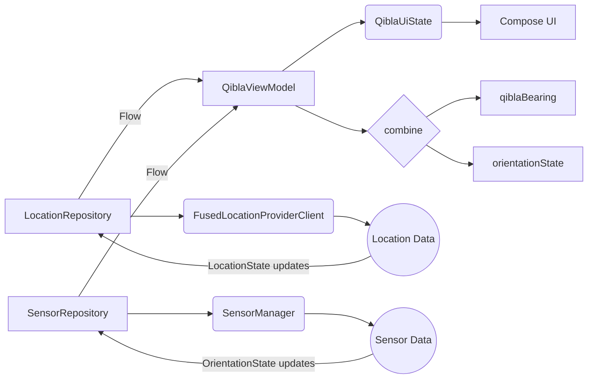
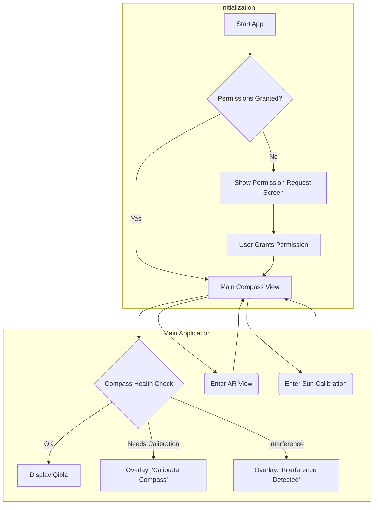

# Qibla Application: Technical Design Document (Rev. 3)

**Author:** Gemini AI Assistant
**Date:** July 29, 2025
**Status:** Revised Draft

## 1. Introduction & Goals

This document specifies the technical design for a modern, high-precision Qibla locator application for Android. The primary goal is to deliver a reliable and trustworthy user experience by proactively addressing the core challenges of mobile sensor accuracy: location ambiguity and magnetic interference.

The architecture prioritizes:

*   **Accuracy:** Employing best-practice sensor fusion and providing verification tools.
*   **Transparency:** Clearly communicating the current state of sensor accuracy to the user.
*   **Resilience:** Offering alternative methods (AR, Sun) when the primary compass is unreliable.

**Context:** Location: Rawang, Selangor, Malaysia (3.32° N, 101.58° E); Time: 18:36 UTC+08

## 2. User Stories

*   As a user, I want to see the Qibla direction immediately upon opening the app, so that I can pray without delay.
*   As a user, I want to be warned if the compass reading is inaccurate due to metal objects, so that I don't follow a wrong direction.
*   As a user, I want to know how precise my location data is, so that I can have confidence in the calculated angle.
*   As a user, I want to use my camera to verify the direction against the sun, so that I have a foolproof way to find the Qibla, especially outdoors.
*   As a user, I want a simple, clean interface that doesn't overwhelm me with technical data, but makes it available if I need it.

## 3. System Architecture

The application follows the MVVM (Model-View-ViewModel) architecture.

**Components:**

*   **UI Toolkit:** Jetpack Compose
*   **Asynchronicity:** Kotlin Coroutines & Flow
*   **Location:** FusedLocationProviderClient
*   **Sensors:** SensorManager
*   **Augmented Reality:** ARCore

**Technology Stack:**

*   **Language:** Kotlin
*   **Architecture:** MVVM with ViewModel

### System Architecture Diagram

### App Navigation Flow


## 4. Core Module: Location & Geodesy

This module is responsible for determining the user's location and calculating the bearing to the Kaaba.

### A. Location Provider Client

The `FusedLocationProviderClient` will be used to acquire device location. It will be configured to request high-accuracy updates with the following settings:

```kotlin
val locationRequest = LocationRequest.create().apply {
    interval = 10000 // 10 seconds
    fastestInterval = 5000 // 5 seconds
    priority = LocationRequest.PRIORITY_HIGH_ACCURACY
}
```

### B. Permissions & Graceful Degradation

The app will request `ACCESS_FINE_LOCATION`. The logic must handle all user responses:

*   **Granted:** Proceed with high-accuracy location fetching.
*   **Denied:** The UI must clearly state that the app cannot function without location and provide a button to re-prompt or go to system settings.
*   **Granted with "Approximate":** The app will function, but the UI must display a prominent warning that the Qibla angle may be less accurate due to imprecise location.

### C. Geodesic Calculation (Qibla Bearing)

*   **Constants:** Kaaba Latitude: 21.4225, Kaaba Longitude: 39.8262.
*   **Formula:** The initial bearing will be calculated using the great-circle formula based on the user's location.

    ```
    ΔL = lon₂ - lon₁
    Y = sin(ΔL) * cos(lat₂)
    X = cos(lat₁) * sin(lat₂) - sin(lat₁) * cos(lat₂) * cos(ΔL)
    Bearing = atan2(Y, X)
    ```

    (All angular values converted to radians for calculation, then result converted back to degrees and normalized to 0-360).

*Example (Rawang):* The calculated bearing is ~292.6° from True North.

## 5. Core Module: Orientation Engine

This module is responsible for determining which way the phone is pointing.

### A. Fused Orientation with ROTATION_VECTOR

We will exclusively use the `Sensor.TYPE_ROTATION_VECTOR`. This virtual sensor provides a clean, hardware-fused orientation, preventing the jitter and complexity of manually processing raw accelerometer and magnetometer data.

### B. True North Correction

The `ROTATION_VECTOR` provides orientation relative to Magnetic North. This must be converted to True North.

1.  **Get Magnetic Azimuth:** Convert the `ROTATION_VECTOR` output to a rotation matrix, then use `SensorManager.getOrientation()` to extract the magnetic azimuth.
2.  **Get Magnetic Declination:** Use the `GeomagneticField` class with the user's current location and time to get the local magnetic declination.

    ```kotlin
    val geomagneticField = GeomagneticField(
        location.latitude.toFloat(),
        location.longitude.toFloat(),
        location.altitude.toFloat(),
        System.currentTimeMillis()
    )
    val declination = geomagneticField.declination
    ```

3.  **Calculate True Heading:** `True Heading = (Magnetic Azimuth + Magnetic Declination + 360) % 360`. This is the final heading used for the UI.

### C. Sensor Calibration & Health

The UI must guide the user if sensor data is unreliable. The `SensorEvent` for `ROTATION_VECTOR` provides an accuracy status (`event.accuracy`).

*   If accuracy is `SENSOR_STATUS_UNRELIABLE` or `SENSOR_STATUS_ACCURACY_LOW`, the app will display a prompt: "Compass requires calibration. Please move your phone in a figure-8 pattern."

### D. Smart Interference Detection

To actively combat the most common issue, we will monitor the raw magnetic field.

1.  **Monitor:** Listen to `Sensor.TYPE_MAGNETIC_FIELD`.
2.  **Calculate Magnitude:** For each event, calculate the field magnitude: `magnitude = sqrt(x² + y² + z²)`.
3.  **Trigger Warning:** The Earth's magnetic field is normally 25-65 µT. If the magnitude is consistently high (e.g., > 100 µT), a persistent warning will be displayed: 🚨 Magnetic interference detected! Move away from metal objects or electronics.

## 6. User Experience (UX) & UI Layer

The UI, built with Jetpack Compose, will be clean, reactive, and informative.

### A. Main Compass View

A `Canvas` Composable will render the compass rose and the Qibla needle. The needle's rotation will be `(qiblaBearing - trueHeading)` and will be animated using `animateFloatAsState` for smooth movement.

### B. Augmented Reality (AR) View

An alternative mode using ARCore. It will render a 3D arrow or Kaaba model in the live camera feed, making the direction intuitive and independent of compass interference once initialized.

### C. Sun Calibration View ☀️

A high-confidence verification tool, especially useful outdoors.

*Context (Rawang, 18:36):* The sun is low in the western sky, making it a perfect calibration target.

*Implementation:* Use CameraX for the preview. An astronomical library will calculate the sun's true azimuth. The user aligns an on-screen graphic with the sun, allowing the app to calculate the exact sensor error and apply a correction.

### D. Status & Error Display Strategy

A dedicated, non-intrusive status bar at the top or bottom of the screen will display real-time information using clear icons and text:

*   **Location:** 🛰️ GPS (±5m) or 📶 WiFi (±30m)
*   **Compass:** ✅ Calibrated or ⚠️ Interference or 🔄 Calibrating...

## 7. Application Logic & State Management

### A. MVVM Architecture

A `QiblaViewModel` will manage the app's state and business logic, exposing data to the Compose UI via `StateFlow`.

### B. State Representation

The entire UI state will be encapsulated in a single data class to ensure consistency.

```kotlin
data class QiblaUiState(
    val locationState: LocationState = LocationState.Loading,
    val orientationState: OrientationState = OrientationState.Initializing,
    val qiblaBearing: Float? = null
)

sealed interface LocationState {
    object Loading : LocationState
    data class Available(val location: Location) : LocationState
    data class Error(val message: String) : LocationState
}

sealed interface OrientationState {
    object Initializing : OrientationState
    data class Available(
        val trueHeading: Float,
        val compassStatus: CompassStatus
    ) : OrientationState
}

enum class CompassStatus {
    OK,
    NEEDS_CALIBRATION,
    INTERFERENCE
}
```

### C. Data Flow Logic

1.  **Init:** ViewModel starts, requests location permissions.
2.  **Location Flow:** A `Flow` from a `LocationRepository` provides `LocationState` updates.
3.  **Sensor Flow:** A `Flow` from a `SensorRepository` combines `ROTATION_VECTOR` and `MAGNETIC_FIELD` data to provide `OrientationState` updates.
4.  **Combine:** The ViewModel uses `combine` on these flows. When the first valid location arrives, it calculates the `qiblaBearing`. It continuously updates the `orientationState`.
5.  **UI Reaction:** The Compose UI collects the `QiblaUiState` `StateFlow` and renders the entire UI based on its contents.

## 8. Manual Location Adjustment

This feature allows users to manually adjust their location on a map if the GPS location is inaccurate, especially indoors.

### A. Earth View (Top View)

A top-down map view will be displayed, allowing the user to see their current location (if available) and a draggable pin.

### B. Draggable Pin

The user can drag the pin to a more accurate location on the map.

### C. Accuracy Circle

A circle will be centered on the pin, representing the estimated accuracy radius. The size of this circle indicates the minimum accuracy within which the Qibla direction can be determined based on the selected location.

### D. Integration with Geodesic Calculation

The manually adjusted location will be used in the geodesic calculation (Qibla Bearing) module, overriding the GPS location if a manual location is set.